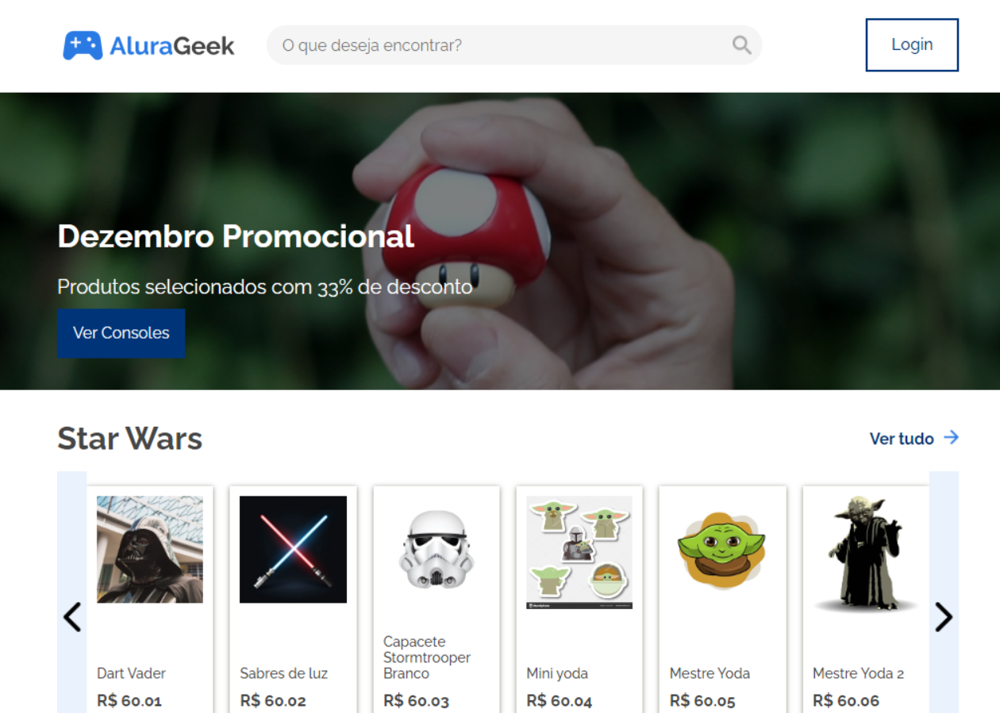

# Projeto-alurageek

## 🔧 Tecnologias utilizadas:

- HTML
- CSS
- Javascript

## Observações do projeto:

- Responsividade
- Modularização do HTML
- Acessibilidade
- Componetização das páginas
- Tratamento de JSON

### Acessibilidade

- A acessibilidade segue quase todos os padrões da extensão <b>wave evaluation tool</b>;
- Durante o cadastro do Produto é possível inserir o texto Alternativo.

### Plus

- Criação de um Slider, de forma manual

[Clique aqui para visualizaçäo prévia da aplicaçäo!](https://karinewagner.github.io/Projeto-alurageek/)

